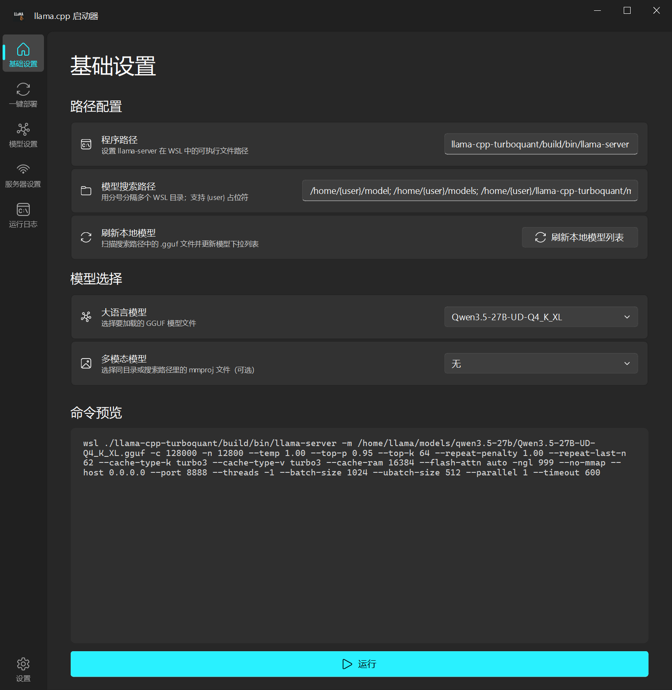
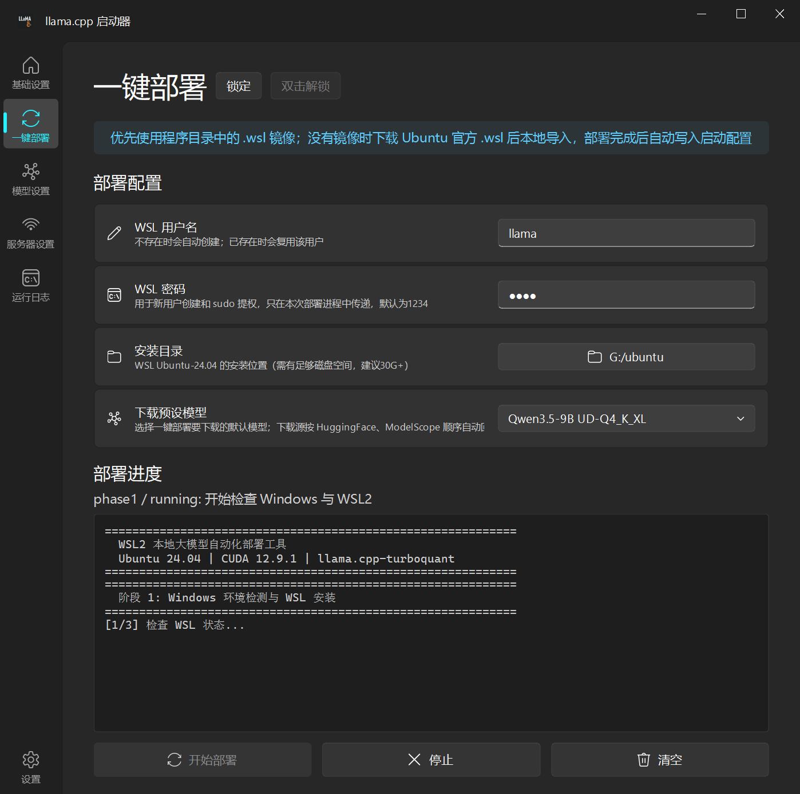
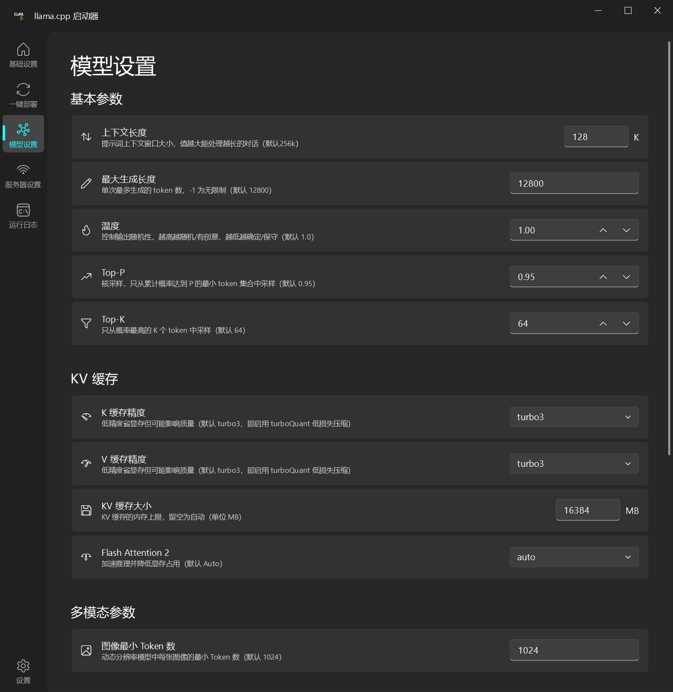
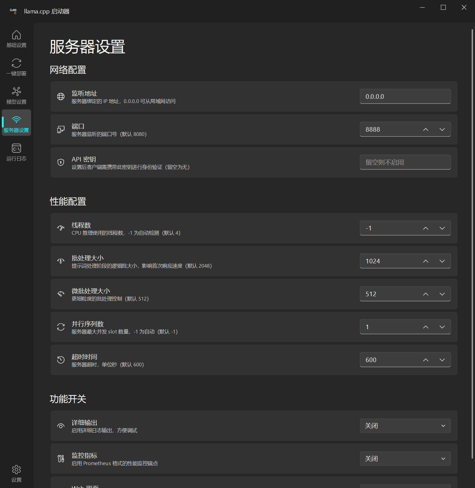

# 作者的话
本项目代码包括文档95%由AI生成，有问题就问AI吧。  

--- 

# llama.cpp Launcher

一个基于 PySide6 + Fluent Design 的 llama.cpp 服务端图形化启动器，用于在 Windows 上通过 WSL2 快速配置和启动带TurboQuant KVcache的 `llama-server`。

## 功能特性
- **一键部署** — 在 WSL2 中自动准备 Ubuntu 24.04、CUDA、llama.cpp-turboquant 和默认模型
- **可视化参数配置** — 通过分页界面配置模型、采样、KV 缓存、GPU 加速、服务器等所有参数，无需手动拼接命令行
- **实时命令预览** — 基础设置页面实时显示最终拼接的完整 WSL 启动命令
- **模型管理** — 支持按 WSL 搜索路径扫描真实存在的 `.gguf` 模型，避免硬编码某台机器的模型路径
- **部署防误触** — 开始部署前二次确认；一键部署页支持锁定，解锁需要双击
- **启动器设置** — 左下角齿轮入口支持语言、主题、字体比例和配置重置
- **内嵌终端** — 运行日志页面直接显示 `llama-server` 的输出，支持启动/停止/清空操作
- **配置持久化** — 运行参数和启动器偏好统一保存到 `core/config.json`
- **一键打包** — 支持通过 PyInstaller 打包为独立 `.exe` 文件


## 来源说明
- **推理后端:** [llama.cpp](https://github.com/ggml-org/llama.cpp)
- **TurboQuant 支持:** [TheTom/llama-cpp-turboquant](https://github.com/TheTom/llama-cpp-turboquant)
- **GGUF 模型:** [Unsloth](https://unsloth.ai/docs)


## 截图

| 基础设置 | 模型设置 |
|:---:|:---:|
|  |  |

| 服务器设置 | 运行日志 |
|:---:|:---:|
|  |  |

## 环境要求

- Windows 10/11
- CUDA GPU 
- BIOS 开启CPU虚拟化vt
- [WSL](https://learn.microsoft.com/zh-cn/windows/wsl/install)（已安装并配置好 Linux 发行版）
- 手动启动服务时需要 WSL 中已编译好的 [llama.cpp](https://github.com/ggerganov/llama.cpp)；也可以先使用「一键部署」自动准备
- Python 3.10+
- 推荐预留 50 GB 以上 WSL 系统空间；一键部署仅用于CUDA后端，CPU及其他后端未测试


## 安装 

```powershell
git clone https://github.com/pearlrice/llama.cpp.launcher.git
cd llama.cpp.launcher
```

### 自动安装脚本：
``build_portable.bat``

1.双击运行```build_portable.bat```会在根目录生成exe

2.双击```llama.cpp.launcher.exe```运行启动器


### 手动：
```powershell
git clone https://github.com/pearlrice/llama.cpp.launcher.git
cd llama.cpp.launcher
python -m venv .venv
.\.venv\Scripts\Activate.ps1
pip install -r requirements.txt

# 运行：
python .\launcher.py

```


---------------------------------------------------------------------


## 启动器参数和逻辑

### 1. 配置文件

| 文件 | 用途 | 
|------|------|
| `core/default_config.json` | 默认配置模板，「还原所有参数设置为默认」会读取它 | 
| `core/config.json` | 用户运行参数、模型搜索路径、已扫描模型列表、语言、主题、字体比例 |
| `core/deploy_result.json` | 一键部署完成后的结果文件，启动器读取后更新配置 | 

首次运行时，如果没有 `core/config.json`，启动器会读取 `core/default_config.json` 作为默认值；正常关闭启动器后会把配置写入 `core/config.json`。  
启动器设置已经合并到 `core/config.json` 的 `launcher` 字段中，不再维护单独的 `launcher.json`。

### 2. 配置模型列表

`core/config.json` 是用户配置文件。模型列表保存在 `models` 字段中，但默认不再写死某台机器的路径；用户可以在「基础设置」的「模型搜索路径」中填写 WSL 目录，然后点击「刷新本地模型列表」扫描实际存在的 `.gguf` 文件。

```json
{
  "models": {
    "llm": {
      "Qwen3.5-27B-UD-Q4_K_XL": "/home/user/models/qwen3.5/Qwen3.5-27B-UD-Q4_K_XL.gguf"
    },
    "mm": {
      "Qwen3.5-mmproj-F16": "/home/user/models/qwen3.5/qwen-mmproj-F16.gguf"
    }
  }
}
```

- 路径为 WSL 内的 Linux 路径
- 默认搜索 `/home/{user}/model`、`/home/{user}/models`、`/home/{user}/gguf_models`、`/home/{user}/llama-cpp-turboquant`
- 一键部署完成后会自动把默认模型和启动参数写回 `core/config.json`

一键部署下载的模型默认放在：

```text
/home/<user>/gguf_models/<preset>/
```

每个模型预设使用独立子目录，避免不同模型的 `mmproj` 文件混淆。

### 3. 一键部署

**部署逻辑：**

- 检查 WSL2 和 `Ubuntu-24.04` 是否真实可用。
- 优先使用程序目录下已有的 `.wsl` 镜像。
- 没有本地镜像时，先下载 Ubuntu 官方 `.wsl` 镜像；官方源测速低于 2 MB/s 或下载失败时，会依次切换阿里云、中山大学备用源。
- 支持在一键部署页选择预设模型：默认 `Qwen3.5-9B`，也可选 `Qwen3.5-27B`、`Gemma 4 31B`；每个预设优先 HuggingFace，失败后回退 ModelScope。
- 预设模型下载到 `/home/<user>/gguf_models/<preset>/`，同一预设的 LLM 和 mmproj 放在同一个子目录中。
- 最后才尝试从缓慢的微软服务器下载（不推荐） `wsl --install --web-download`。
- 部署完成后写入 `core/deploy_result.json`，启动器读取它并更新 `core/config.json`。

一键部署页有 **防误触** 机制：

- 点击「开始部署」前会弹出二次确认。
- 标题右侧有「锁定」和「双击解锁」按钮。
- 锁定后部署配置和操作按钮不可用，部署日志仍可选择和复制。
- 部署成功（服务器成功推理）后会自动进入锁定状态。


### 4. 配置参数

应用包含五个页面：

| 页面 | 内容 |
|------|------|
| **基础设置** | 程序路径、模型搜索路径、模型选择、命令预览、运行按钮 |
| **一键部署** | WSL 用户名、密码、安装目录、部署日志、阶段状态 |
| **模型设置** | 模型选择、采样参数、KV 缓存、多模态、GPU 加速 |
| **服务器设置** | 网络配置、性能参数、功能开关 |
| **运行日志** | 终端输出、启动/停止/清空控制 |
| **设置** | 语言、主题、字体比例、参数重置、启动器设置重置 |

### 5. 启动器设置

左下角齿轮图标进入启动器设置。

支持：

- 语言：`CH` / `EN`
- UI 颜色：深色、浅色、跟随系统
- 字体大小：`80%` 到 `130%`，步进 `5%`
- 还原所有参数设置为默认：读取 `core/default_config.json` 并写回 `core/config.json`
- 还原启动器设置：恢复语言、主题、字体比例

### 6. 运行

在基础设置页面确认命令预览无误后，点击底部「运行」按钮即可启动 `llama-server`。


## 支持的 llama-server 参数

**此处设置参考官方llama-server,根据模型不同而不同**
<details>
<summary>点击展开完整参数列表</summary>

| 分类 | 参数 | 说明 |
|------|------|------|
| 模型 | `-m` | 模型文件路径 |
| 模型 | `-mm` | 多模态投影器路径 |
| 模型 | `-c` | 上下文长度 |
| 模型 | `-n` | 最大生成长度 |
| 采样 | `--temp` | 温度 |
| 采样 | `--top-p` | Top-P 核采样 |
| 采样 | `--top-k` | Top-K 采样 |
| 采样 | `--repeat-penalty` | 重复惩罚 |
| 采样 | `--repeat-last-n` | 惩罚回溯窗口 |
| 缓存 | `--cache-type-k/v` | K/V 缓存精度 |
| 缓存 | `--cache-ram` | KV 缓存大小 |
| 缓存 | `--flash-attn` | Flash Attention |
| 多模态 | `--image-min-tokens` | 图像最小 Token 数 |
| GPU | `-ngl` | GPU 卸载层数 |
| GPU | `-mg` | 主 GPU 设备 ID |
| GPU | `-ts` | 张量分割比例 |
| GPU | `--no-mmap` | 禁用内存映射 |
| GPU | `--numa` | NUMA 优化策略 |
| 服务器 | `--host` | 监听地址 |
| 服务器 | `--port` | 端口 |
| 服务器 | `--api-key` | API 密钥 |
| 服务器 | `--threads` | 线程数 |
| 服务器 | `--batch-size` | 批处理大小 |
| 服务器 | `--ubatch-size` | 微批处理大小 |
| 服务器 | `--parallel` | 并行序列数 |
| 服务器 | `--timeout` | 超时时间 |
| 开关 | `--verbose` | 详细输出 |
| 开关 | `--metrics` | 监控指标 |
| 开关 | `--no-webui` | 禁用 Web 界面 |

</details>


## 许可证

[MIT License](LICENSE)
